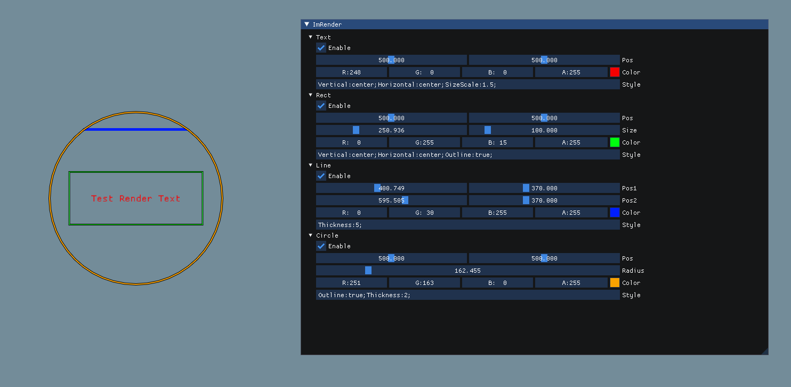

# ImRender

### 特点



在这个库中我引入了一个**“字符串样式”**的概念

**像这样:**

```c++
ImRender->Text("Test", ImVec2(100.f,100.f), "Horizontal:center;");
```

这第二个字符串参数就是我们的样式.

这种方法可以避免传递参数困难.

什么是传递参数困难? 像这样:

```c++
// 方法定义:
ImVec2 Text(std::string text, ImVec2 pos, ImVec4 color, bool outline = false, bool top_bottom_center = false, bool to_top = false, bool left_right_center = false, bool to_left = false);

// 普通调用:
// 我只是想把“to_lef”这个参数传为true，却要传这么一堆参数
Text("Test", ImVec2(100.f, 100.f), false, false, false, false, true);
// 这一点也不优雅！！

// 优雅的调用:
ImRender->Text("Test", pos, color, "Horizontal:left;");
```

在这个库中，你只需要传递字符串就能解决这个问题.

### 使用方法

像老样子传递参数就好了

我要怎么传递“Style”参数呢？

```c++
// 别把它想得太难了
// 例子:
ImRender->Text("Test", pos, color, "Horizontal:center;Outline:true");
ImRender->Rect(pos, size, color, "Horizontal:center;Outline:true;Thickness:2.f;");
ImRender->Line(pos1, pos2, color, "Outline:true;Thickness:2.555555;");
ImRender->Circle(pos, radius, color, "Outline:true;");
```

我可以传哪些“style”参数呢？

| 方法   | 可以接受的样式                                               |
| ------ | ------------------------------------------------------------ |
| Text   | Horizontal, Vertical, Outline, SizeScale, Strikethrough, Underline |
| Rect   | Horizontal, Vertical, Outline, Fill, Thickness, Rounding     |
| Line   | Thickness, Outline                                           |
| Circle | Outline, Fill, Thickness                                     |

他们都是什么类型的参数？

| 名称          | 类型                           | 可接受的传值            |
| ------------- | ------------------------------ | ----------------------- |
| Horizontal    | ImRenderHorizontalAxisDockType | "left" "right" "center" |
| Vertical      | ImRenderVerticalAxisDockType   | "top" "bottom" "center" |
| Outline       | Bool                           | "true" "false"          |
| SizeScale     | 全体自然数                     |                         |
| Strikethrough | Bool                           | "true" "false"          |
| Underline     | Bool                           | "true" "false"          |
| Fill          | Bool                           | "true" "false"          |
| Thickness     | Float                          | 全体自然数              |
| Rounding      | Float                          | 全体自然数              |

那我该注意些什么呢？

- 别写错名称(Key)了
- 大小写不重要(你甚至可以传"hORizOnRTal:lEfT;")
- 别忘了 ';'
- 中间不要有空格

### 协议

ImRender 使用的是MIT协议, 详见[LICENSE.txt](../LICENSE.txt).
